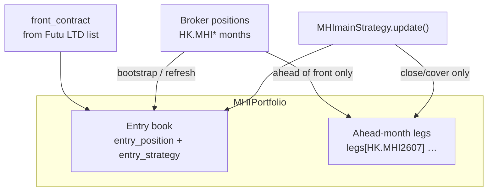
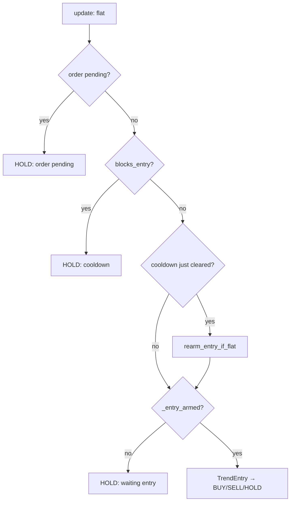
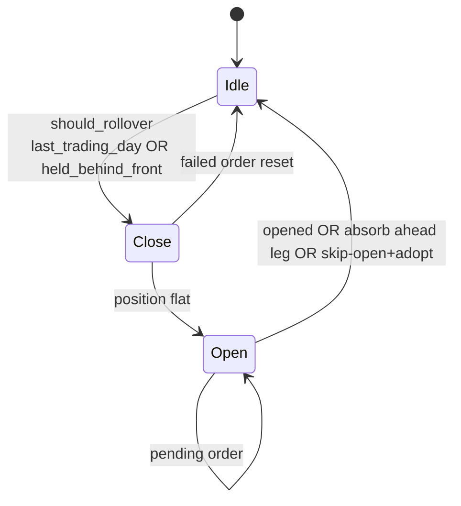
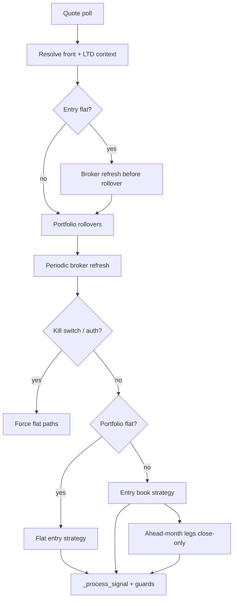

# MHI-only scope & strategy reference

This repo is **MHImain-only**. The generic `run_live` / pair-spread / backtest stack was removed.

Use this document to double-check behaviour against the code in `robs/cli/mhimain.py`, `robs/strategy/`, and `robs/execution/`.

---

## Repo scope

### Removed

| Area | Files |
|------|--------|
| **CLI** | `run_live.py`, `collect.py`, `backtest.py`, `debug_rules.py` |
| **Strategy engine** | `engine.py`, `features.py`, pair/breakout rules in `rules.py` |
| **Execution** | `trader.py` (mhimain uses `execute_unit_order` in `mhimain.py`) |
| **Data pipeline** | `bars.py`, `poller.py`, `store.py` |
| **Backtest** | `robs/backtest/runner.py` |
| **Research models** | `robs/models/*` (ising, attractor, spins) |
| **Config** | `config/default.yaml`, `config/daily.yaml` |

### Kept (MHI)

| Component | Path |
|-----------|------|
| Main trader | `robs/cli/mhimain.py` |
| Strategy | `robs/strategy/mhimain.py`, `entry.py`, `trend.py` |
| Signal types | `robs/strategy/rules.py` (`Action`, `Signal` only) |
| Execution | `robs/execution/*` — rollover, portfolio, risk, order gate |
| Quotes / front month | `robs/data/futu_client.py` |
| Config | `config/mhimain.yaml` |
| Entry script | `run_mhimain.sh`, deploy scripts, tests |

### Docs / deps

- `README.md` and `COMMANDS.md` — MHI-only
- `requirements.txt` — `pyyaml` only
- `load_config()` default → `mhimain.yaml`

---

## System overview

| Item | Value |
|------|--------|
| CLI | `run_mhimain.sh` → `robs/cli/mhimain.py` |
| Config | `config/mhimain.yaml` |
| Symbol | `HK.MHImain` → named months `HK.MHIyyMM` |
| Strategy core | `MHImainStrategy` — trend entry + P/L exits + LTD rollover |

---

## Portfolio books

| Book | What it is | Bot opens? | Bot closes? | Rollover? |
|------|------------|------------|-------------|-----------|
| **Entry book** | Bot-managed front month (or roll-day next month) | Yes | Yes (cut loss / take profit / flat) | Yes — LTD 11:58 roll |
| **Ahead-month leg** | Manual next-month position (e.g. hold `MHI2607` while front `MHI2606`) | **No** | Yes — close/cover only | **No** — skipped (`held_ahead_of_front`) |
| **Behind-front entry** | Entry on older month than broker front | Should not persist | Catch-up roll → front | Yes — `held_behind_front` |



**Bootstrap rule:** only adopts broker positions **ahead of front** as manual legs. Front-month rows on the entry book when `tracks_on_entry_book()` matches (including roll-day bot entries on next month).

---

## Trend modes (`--trend` or `default_trend`)

| Mode | Flat entry | In-position exits | Blocked |
|------|------------|-------------------|---------|
| **bull** | BUY (long) | FLAT, SELL (close long) | Short entries |
| **bear** | SELL (short) | FLAT, BUY (cover short) | Long entries |
| **uncertain** | price &lt; MA → BUY; price &gt; MA → SELL | Same as bull/bear per side | Entry if MA unavailable |

Config: `ma_period: 10` (daily MA from Futu).

---

## Entry rules (flat only)

| Step | Condition | Result |
|------|-----------|--------|
| 1 | Order pending | HOLD |
| 2 | Re-entry cooldown active (`pnl_baseline.locked`) | HOLD |
| 3 | `_entry_armed == false` | HOLD (no trend evaluation) |
| 4 | Trend entry fires | BUY or SELL |
| 5 | Trend filter (bull/bear) | May block wrong side → HOLD |
| 6 | `resolve_entry_order_code()` | Chooses broker month code |
| 7 | No quote row for target month | HOLD (slippage guard) |
| 8 | Stale quote / LTD ban / auth / kill | HOLD |

**Which month for a flat entry?**

| Situation | Order code |
|-----------|------------|
| Normal day | Broker **front** month (e.g. `HK.MHI2606`) |
| LTD, 11:58–16:30 HKT | **Next** month (expiring month open ban) |
| LTD, after 11:58 (`rollover_on_last_trade_day: true`) | **Next** month |
| LTD, after 11:58 (roll flag off) | Still **next** month (11:58+ rule) |

LTD **calendar date** is adaptive per contract from Futu (`contract_last_trade_time`); only **times** (11:58 / 16:30 / 17:15) are fixed in code.

---

## Exit rules (in position)

| Exit | Trigger | Blocked by |
|------|---------|------------|
| **Cut loss** | P/L ≤ baseline − `cut_loss_pts` (20 pts) | Min hold (`cut_loss_min_hold_hours` = 0.12 h); panic pause |
| **Take profit** | P/L ≥ baseline + `take_profit_pts` (40 pts) | Nothing |
| **Rollover / kill / auth** | FLAT from other paths | Bypasses strategy thresholds |

P/L baseline: **0** on new entry this session; at launch, bootstrapped from broker open P/L.

---

## Re-entry cooldown vs `_entry_armed`

Two separate gates when flat:

| | Re-entry cooldown | `_entry_armed` |
|--|-------------------|----------------|
| **Purpose** | Wait after any exit before new entry | Permission to evaluate trend entry rules |
| **Mechanism** | `pnl_baseline.locked` + `blocks_entry()` | Boolean on `MHImainStrategy` |
| **After cut loss / TP** | Always starts | Stays false until `rearm_entry_if_flat()` |
| **After order submit** | Unchanged | false (`set_order_pending`) |
| **User message** | `cooldown: …` | `flat, waiting entry` or `order pending` |

**Cooldown config** (`config/mhimain.yaml`):

| Parameter | Value | Rule |
|-----------|-------|------|
| `reentry_minimum_hours` | 0.4 h | Always wait this long first |
| `reentry_move_pts` | 30 pts | After minimum: clear if price moves this far from exit |
| `reentry_trading_hours` | 0.24 h | After minimum: or clear when this time elapses |

Clears after **minimum wait**, then **either** move **or** time (whichever comes first).

**`_entry_armed` becomes false when:** fill / broker open detected / order pending / launch with open position.

**`_entry_armed` becomes true when:** `rearm_entry_if_flat()` — requires flat **and** cooldown not locked.



---

## Panic pause (cut loss only)

| Parameter | Value | Effect |
|-----------|-------|--------|
| `panic_move_pts` | 150 | Move size in window |
| `panic_window_sec` | 120 | Rolling window |
| `panic_wait_min` | 30 | Block cut loss for 30 min after spike |

Take profit is **not** blocked by panic.

---

## HKEX calendar & rollover

| Event | Time (HKT) | Fixed / adaptive |
|-------|------------|------------------|
| LTD calendar date | Per contract | **Adaptive** — Futu `last_trade_time` |
| In-position roll trigger | **11:58** on held LTD | Fixed time on adaptive date |
| No new opens on expiring month | **11:58 → 16:30** on LTD | Fixed window |
| Front month flips to next | **17:15** on LTD (night) | Fixed time |
| Catch-up if entry behind front | Any time | Roll to broker front |



**Rollover triggers (`should_rollover`)**

| Held vs front | On held LTD ≥ 11:58 | Any time |
|---------------|---------------------|----------|
| Held == front | Roll → next month | — |
| Held **behind** front | Roll → front / next | **Catch-up** → front |
| Held **ahead** of front | **Skip** (manual leg) | **Skip** |

**Rollover open — if target month already held**

| Ahead leg direction | Action |
|--------------------|--------|
| Same or opposite | **Do not** broker-open; **absorb** leg into entry book |

**Month ordering:** `contract_month_key()` parses any `HK.MHIyyMM`; no hardcoded months in logic.

---

## Main loop (each poll)



---

## Order guards (`_process_signal`)

| Guard | Blocks | Bypass |
|-------|--------|--------|
| Stale quote | New entries | FLAT, rollover (`force_flat` / `bypass_entry_guards`) |
| Auth expired / trade locked | All | — |
| LTD expiring-month ban (11:58–16:30) | New entry on **expiring** code | FLAT, rollover |
| Next-month leg | BUY/SELL that **add** | FLAT, SELL (long), BUY (short) |
| Kill switch | New entries | Forced closes |
| No quote row | New entries | Rollover / force flat |
| `max_position_shares` | Orders that exceed cap | — |
| Max slippage | Market orders far from bid/ask | — |

After fills in portfolio mode, `portfolio._sync_risk_shares(risk)` keeps `risk.position_shares` aligned with total signed contracts across all legs.

---

## Risk & safety

| Mechanism | Config | Behavior |
|-----------|--------|----------|
| Daily kill switch | `max_daily_loss_pct: 50%` | Flat all books, halt |
| Stale quotes | `stale_poll_multiplier: 30` × poll interval | Block new entries |
| Trade unlock | `trd_env: SIMULATE` / REAL | REAL needs password; expiry → flatten |
| Position refresh | `position_refresh_sec: 2` | Broker sync + snapshots |
| Position cap | `max_position_shares: 8` (in code) | `approve_order()` before submit |

---

## Sanity checklist

| Check | Expected |
|-------|----------|
| Flat on normal day | Entry on **front** month only |
| LTD before 11:58 | Trade front month normally |
| LTD 11:58+ in position | Close expiring → open next (or adopt existing next) |
| LTD 11:58–16:30 flat entry | Opens **next** month, not expiring |
| Manual `MHI2607` while front `MHI2606` | Leg only; no rollover; bot can close |
| Still on `MHI2606` after front `MHI2607` | Catch-up rollover fires |
| Uncertain + no MA | No entry until MA fetched |
| Bull mode | No shorts |
| Behind-front state | Should not persist; catch-up roll |

---

## Tests

```bash
cd ~/FTAPI4Python_10.4.6408/Robs
../bin/python -m unittest discover -s robs -p 'test_*.py' -v
```

Currently **134 tests** covering rollover, portfolio sync, stale quotes, kill switch, auth expiry, and order gates.
